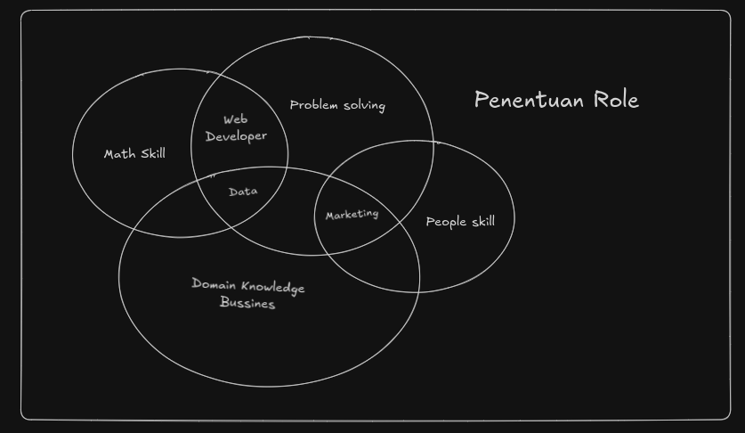

<h1 align="center" style="color:#FF8800;">
  🧭 <span style="color:#FF8800;">Tracktiv8</span>
</h1>

<p align="center">
  <b><span style="color:#FF8800;">Career Track & Course Guidance Platform</span></b><br>
  <a href="https://tracktiv8.vercel.app" style="color:#FF8800;"><b>🚀 Live Demo</b></a>
</p>

## Overview

Tracktiv8 is a platform designed to help users identify and bridge their skill gaps by recommending relevant career tracks and courses, especially leveraging Hacktiv8's educational offerings. The system integrates with Firebase for authentication and data storage, and provides personalized recommendations based on user input.

## Features

-   **Career Track Recommendation:**  
    Users can take a quiz to receive recommended career tracks (e.g., Fullstack JavaScript, Backend GoLang, Frontend React, Data Science, Data Analytics, Digital Marketing).
-   **Course Suggestions:**  
    The system provides direct course links from Hacktiv8 based on the user's selected or recommended career path.
-   **Authentication:**  
    Sign-up and sign-in using Firebase Authentication.
-   **Modern UI:**  
    Uses Next.js (App Router), TailwindCSS, and several custom UI components for a modern, responsive experience.
-   **AI Chat Widget:**  
    Integrated GraniteChatWidget for user support and additional AI-powered assistance.
-   **Personalized Recommendations:**  
    The platform adapts course and track suggestions based on quiz responses and user profile.
-   **Responsive Design:**  
    Fully mobile-friendly and accessible layout.
-   **Progress Tracking:**  
    (Planned) Users will be able to track their progress through recommended tracks and courses.

## AI Support

Tracktiv8 features an integrated AI assistant powered by Replicate's Granite model. This AI is available through the GraniteChatWidget, providing:

-   **Instant Q&A:**  
    Users can ask questions about courses, career paths, and the platform itself, and receive instant, context-aware answers.
-   **Course and Track Guidance:**  
    The AI can recommend tracks and courses based on user queries, supplementing the quiz system.
-   **Onboarding Help:**  
    New users can interact with the AI widget for step-by-step guidance through the signup and quiz process.
-   **Continuous Learning:**  
    The AI model can be updated to support new courses, recommendations, or answer frequently asked questions.

## Project Structure

-   `app/` - Next.js app router pages and API routes
-   `components/` - Reusable UI and feature components (Navbar, Chat Widget, Forms, etc.)
-   `lib/` - Utility libraries (e.g., Firebase config)
-   `public/` - Static assets
-   `tailwind.config.ts` & `postcss.config.mjs` - Styling configs

## Tech Stack

-   **Next.js** (App Router, TypeScript)
-   **TailwindCSS**
-   **Firebase** (Auth, Firestore)
-   **Replicate API** (for AI features)
-   **Radix UI** (UI primitives)



## Getting Started

### Prerequisites

-   Node.js (v18 or above recommended)
-   npm or pnpm

### Installation

```bash
# Install dependencies
npm install

# or
pnpm install
```

### Environment Variables

Create a .env.local file:

```
NEXT_PUBLIC_FIREBASE_API_KEY=your_api_key
NEXT_PUBLIC_FIREBASE_AUTH_DOMAIN=your_auth_domain
NEXT_PUBLIC_FIREBASE_PROJECT_ID=your_project_id
NEXT_PUBLIC_FIREBASE_STORAGE_BUCKET=your_storage_bucket
NEXT_PUBLIC_FIREBASE_MESSAGING_SENDER_ID=your_messaging_sender_id
NEXT_PUBLIC_FIREBASE_APP_ID=your_app_id
REPLICATE_API_TOKEN=your_replicate_api_token
```

### Running Locally

```bash
npm run dev

# or
pnpm dev
```

Navigate to [http://localhost:3000](http://localhost:3000) in your browser

© 2025 Tracktiv8 by [manry-hub](https://github.com/manry-hub)
